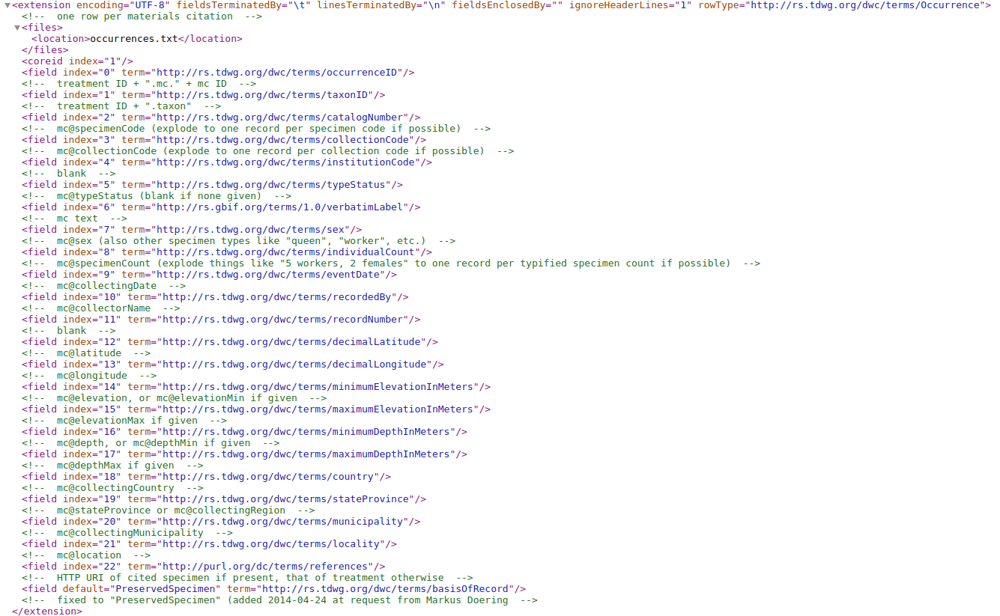

As you know, entomologists often use insect traps and record start times and end times so that trap rates (insects trapped per day) can be calculated. So it is important that these data are included in the DwCA. I was hoping we could use the TDWG recommendation for formatting dates and times because this handles both single times and time periods. Would it be possible to modify code to handle this recommendation?

## Method 1: Using collectingDate, collectingDateMin, collectingDateMax

In this example, the sampling period is formatted using 3 attributes:
* collectingDate:2017-12-10
* collectingDateMin: 2017-12-10
* collectingDateMax: 2017-12-12

If we look at the verbatim version of the GBIF occurrence record (see below), we see that the **collectingDate** is stored as **eventDate**.

However, it appears that the **collectingDateMin** and **collectingDateMax** data are ignored.

Note that the evenDate field which is included in the DWCA is interpreted as '2007-12-10T00:00:00'

https://www.gbif.org/occurrence/3033803308

## Method 2: 

In this example, the sampling period is formatted using 3 attributes:
* collectingDate: 

https://www.gbif.org/occurrence/3332082311

## Mapping of GGI materials citations attributes to DwCA terms

Below is a screenshot of the occurrences part of meta.xml from the DwCA resulting from the Method 2 example. Note that **mc@collectingDate** is mapped to **eventDate** (index 9), and there is no mapping for **collectingDateMin** and **collectingDateMax**.

