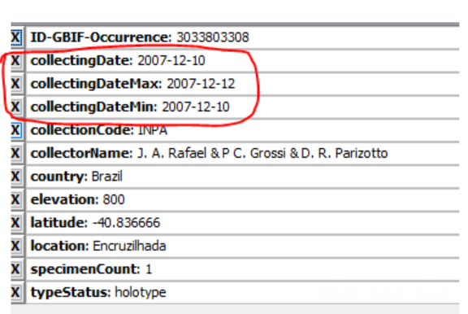
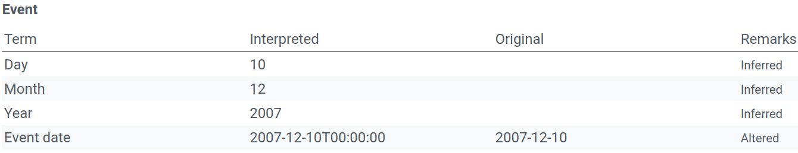
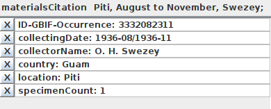
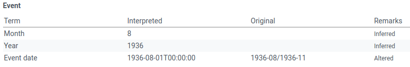

## Method 1: Using collectingDate, collectingDateMin, collectingDateMax

In the verbatim text for this materials citation, the sampling period is formatted as "".

If we look at the verbatim version of the GBIF occurrence record (see below), we see that the **collectingDate** is stored as **eventDate**.

However, it appears that the **collectingDateMin** and **collectingDateMax** data are ignored.

Note that the evenDate field which is included in the DWCA is interpreted as '2007-12-10T00:00:00'

https://www.gbif.org/occurrence/3033803308

## Method 2: 

https://www.gbif.org/occurrence/3332082311

