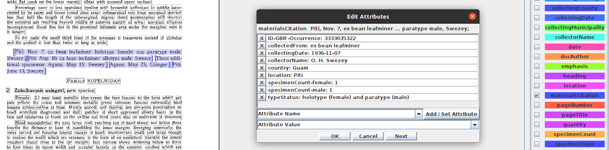
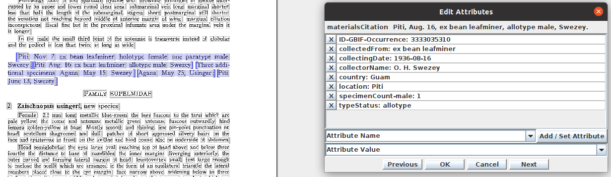
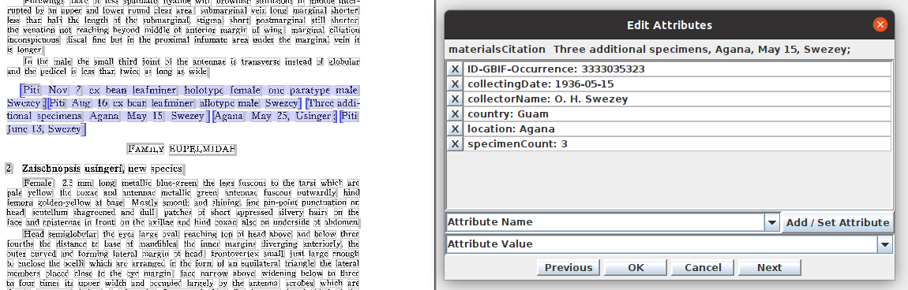
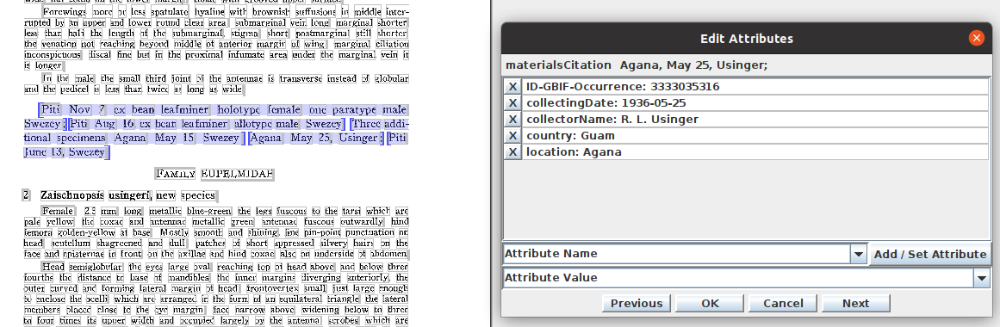
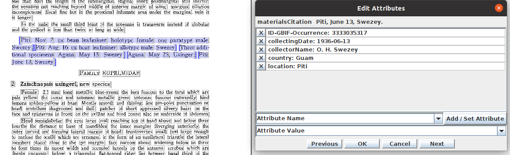

* Load a document into GGI and display **materialsCitation** blocks. Here we loaded FFD1FFF8FFF9FFB3FFC86E5DFFBE8B32.

* For the first species in this document, there are 5 matCits.

* Left-click on the first matCit and select **Edit materialsCitation Attributes**. 

* Use the **Edit Attributes** dialog to manual parse the matCit.

## matCit2

## matCit3

## matCit4

## matCit5

## Example Attributes

* collectingDate: 1936-05-25
* collectorName: R. L. Usinger
* country: Guam
* location: Agana
* specimenCount: 3
* specimenCount-male: 2
* specimenCount-female: 2
